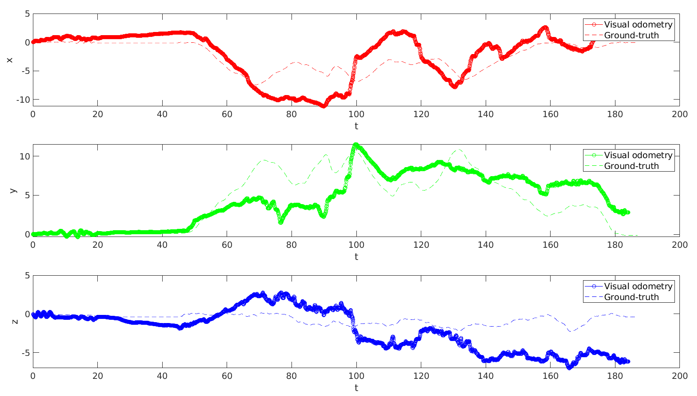
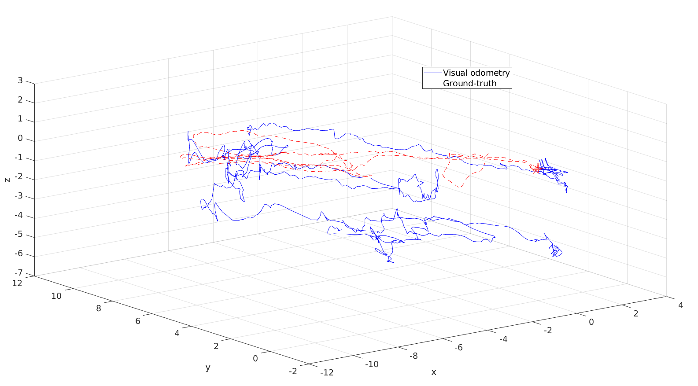
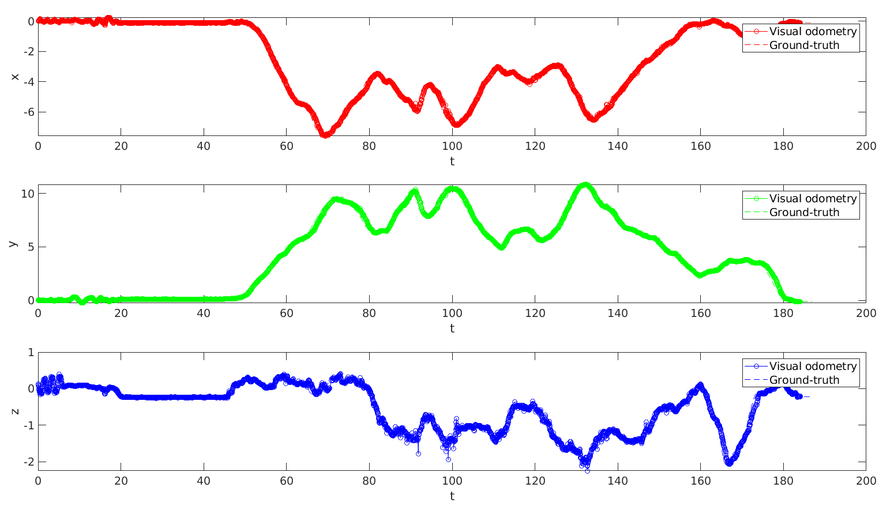
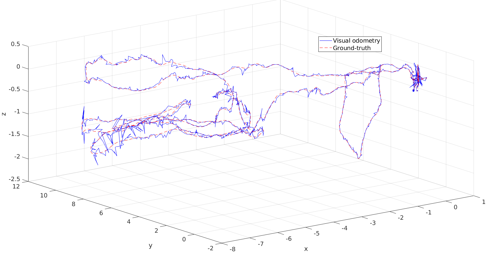

# Mobile Robot Pose Estimation using Visual Odometry

This code implements location estimation using visual odometry.

## Acknowledgments
For validation it has been used the [EuRoC MAV Dataset](https://projects.asl.ethz.ch/datasets/doku.php?id=kmavvisualinertialdatasets).

The algorithm used to solve the PnP problem comes from [here](https://github.com/cvlab-epfl/EPnP).

The functions used to convert rotation matrix to quaternion comes from [here](https://gist.github.com/shubh-agrawal/76754b9bfb0f4143819dbd146d15d4c8).

## Build
```
catkin_make
```

## Run
```
rosrun visual_odometry visual_odometry
rosbag play <rosbag_file.bag>
```

## Pose estimation with no correction
Pose estimation in blue and ground-truth in red.






## Pose estimation with correction
Pose estimation in blue and ground-truth in red.





